# Digital Banking Frontend

This is the frontend for a Digital Banking application. It interacts with a backend built using Spring Boot.

# Application Components

## Navbar
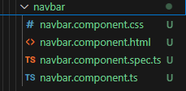

## Customer Component
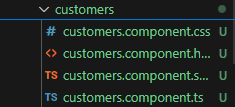

# Services

## Customer Service
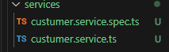

# Testing the "/customer" Endpoint
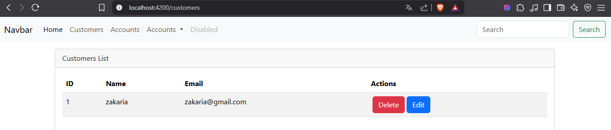

# Deleting a Customer

## Confirmation Dialog
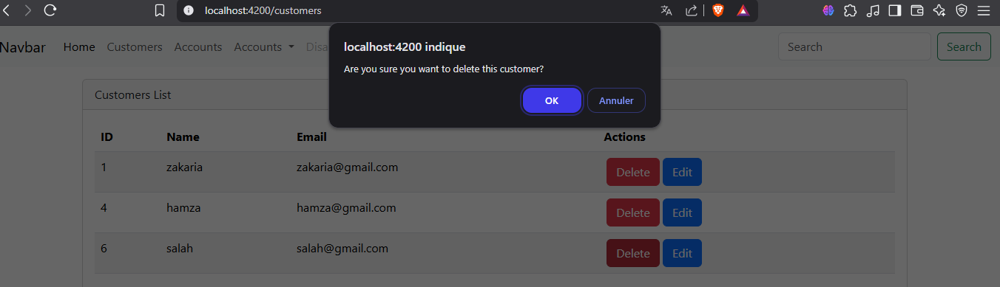

## Success Popup Message
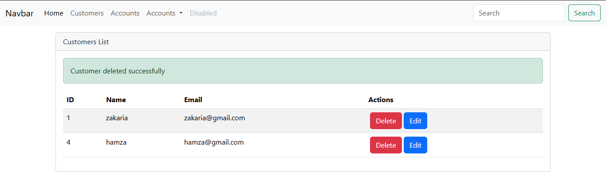

# Adding a Customer

## Add Button in the Customer Component HTML
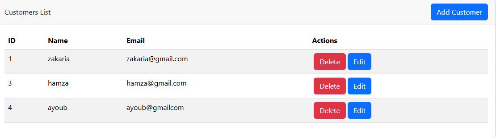

## Add Customer Form
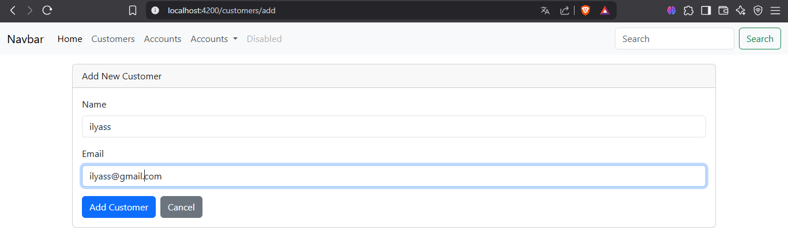

## Successful Customer Addition
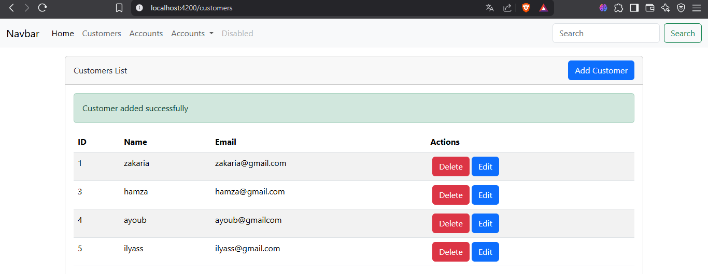

# Editing a Customer

## Edit Customer Form

## Successful Customer Update
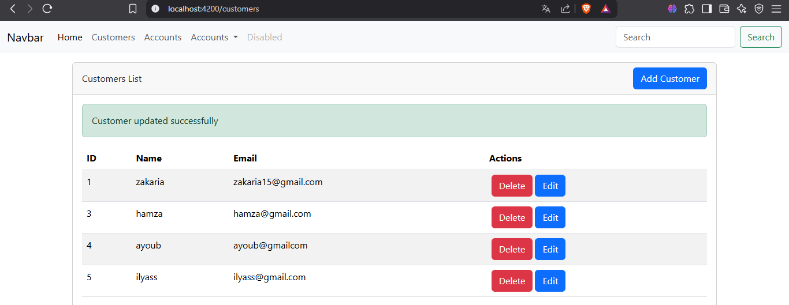

# Search Customers by keywords
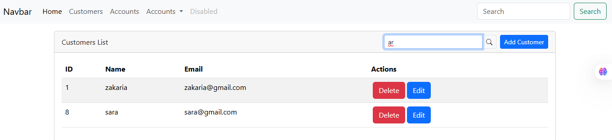