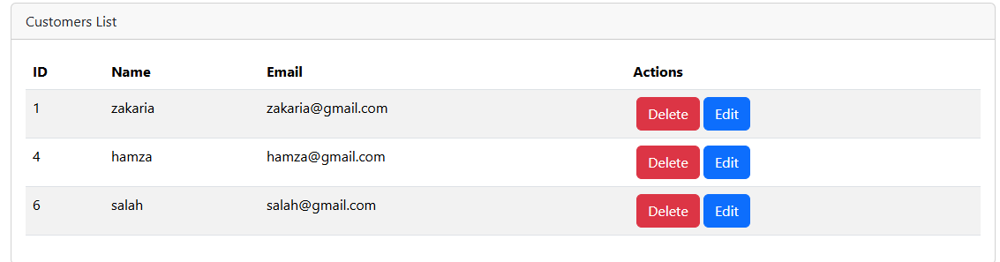
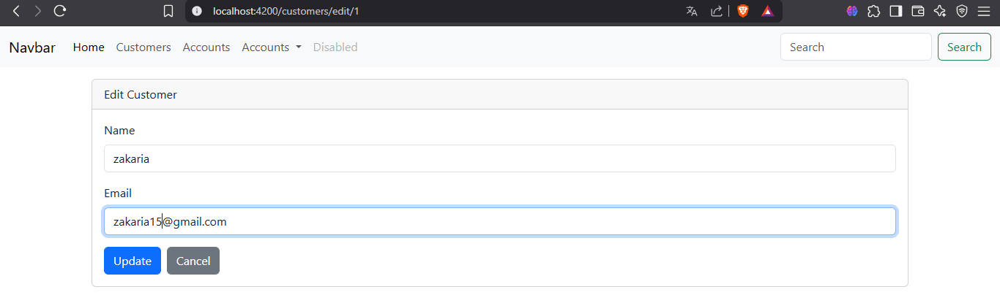

# Digital Banking Frontend

This is the frontend for a Digital Banking application. It interacts with a backend built using Spring Boot.

# Application Components

## Navbar

## Customer Component

# Services

## Customer Service

# Testing the "/customer" Endpoint

# Deleting a Customer

## Confirmation Dialog

## Success Popup Message

# Adding a Customer

## Add Button in the Customer Component HTML

## Add Customer Form

## Successful Customer Addition

# Editing a Customer

## Edit Customer Form

## Successful Customer Update

# Search Customers by keywords
